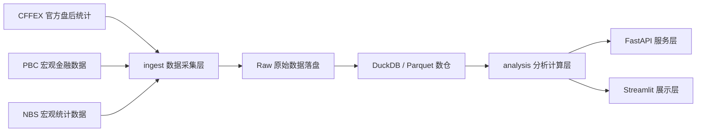

# 系统设计文档

## 1. 系统定位

本系统定位为基于真实公开数据的中国股指期货盘后分析平台，面向教学、研究和毕业设计答辩场景。系统不承担自动交易与未授权实时行情分发职责，重点解决数据采集、分析建模、风险评估和可视化展示问题。

## 2. 总体架构

## 3. 模块划分

### 3.1 数据采集层

- `CffexClient`
  - 抓取 CFFEX 官方 XML 日统计
  - 解析 `IF`、`IH`、`IC`、`IM` 合约日频行情
  - 提取合约信息、交易日历和交易所通知
- `PbcClient`
  - 抓取金融统计数据报告
  - 提取 `M2`、`M1`、社融、贷款、利率等宏观因子
- `NbsClient`
  - 抓取国家统计局公开发布页面
  - 提取 `CPI`、`PPI`、工业增加值等指标

### 3.2 数据存储层

- 原始层：保存抓取页面与 XML 原文
- 标准层：
  - `contracts`
  - `trade_calendar`
  - `futures_daily`
  - `notice_events`
  - `macro_series`
  - `ingestion_log`
  - `source_catalog`
- 分析层：
  - `main_contract_daily`
  - `volatility_forecast`
  - `analysis_snapshot`
  - `correlation_matrix`
  - `comparison_frame`
  - `market_overview`
  - `quality_report`
  - `notice_summary`

### 3.3 分析层

- 主力连续构建
- 收益率、累计收益率、均线、回撤分析
- 成交量异动识别
- 5 日、20 日、60 日历史波动率
- 基于 EWMA 与历史波动加权的未来 5 日波动率预测
- 历史模拟法 `VaR`
- 股指收益率与宏观因子相关性分析
- 数据质量报告与数据源追溯

### 3.4 服务与展示层

- `FastAPI`
  - 提供行情查询、分析指标、系统健康检查接口
- `Streamlit`
  - 提供答辩展示页、行情页、趋势与波动页、风险页和数据来源页

## 4. 与开题报告的对应

- 开题报告中的“数据采集、存储、处理、分析及可视化”均已具备实现
- “趋势分析、波动率预测、相关性分析、VaR 计算”等核心分析能力已落地
- “多源数据”当前采用公开可核验数据实现，覆盖交易所行情与宏观基本面数据
- “Lambda / Hadoop / Kafka”在论文中保留为扩展架构说明，系统实现以本机可部署原型为主

## 5. 运行流程

1. 运行 `scripts/refresh_data.py` 抓取真实公开数据
2. 原始文件写入 `data/raw/`
3. 标准化结果写入 `DuckDB` 与 `Parquet`
4. 计算主力连续、趋势、波动率预测、相关性与 `VaR`
5. 启动 API 和前端进行查询与展示

## 6. 本机部署策略

- 默认主流程采用 `Pandas + DuckDB`
- `Spark local mode` 作为大数据批处理能力展示，可通过 `--enable-spark` 打开
- 提供 `scripts/run_local_stack.py` 与 `start_local.bat` 作为一键运行入口
